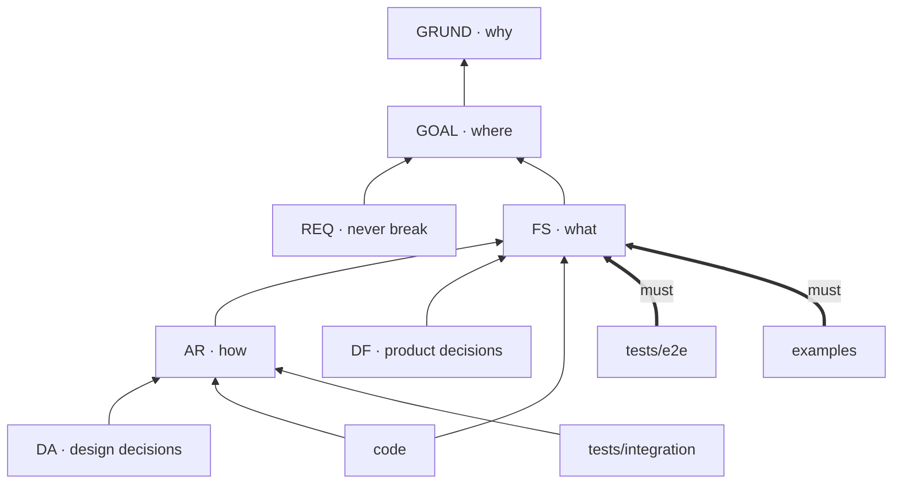

# grund

[](https://github.com/agent-grounds/grund/actions/workflows/ci.yml) [](https://crates.io/crates/grund) [](LICENSE)

> **Keep your agents grounded** — specs, docs, and code as one knowledge graph, always in sync.

`grund` exists so you always know *why* — why your agents did what they did, why a line is the way it is: all work stays grounded in the spec that called for it ([§GRUND-grund](docs/grund.md#grund-grund-agents-stay-grounded-in-the-spec)). Keeping the why means keeping a structure, and `grund` takes on the two parts of it that are hard:

- **The shape of what your project knows** — its kinds of fact, where each lives, and how it is sectioned — declared once in `grund.toml`, with every fact at a stable ID that is fetched on demand in minimal tokens instead of re-read from whole files ([§GRUND-schema](docs/grund.md#grund-schema-the-shape-of-a-projects-knowledge-is-hard-to-define-and-to-keep)).

## How it works

<!-- grund:fmt off -->
<table>
<tr>
<td valign="top" width="31%">
<b>1 · Declare</b><br>
A spec point gets a stable ID
<pre>
&#35; FS-check: …
&#35;&#35;&#35; 3.2 Missing section
A citation with a section
suffix […] where the
declaration exists but
the requested section
heading does not.
</pre>
</td>
<td>➜</td>
<td valign="top" width="31%">
<b>2 · Cite</b><br>
Code points back to the spec
<pre>
// §FS-check.3.2: the ID
// resolves but no
// declaration has a
// heading at the cited
// section path — …
if let Some(sec) =
    &amp;cite.section {
</pre>
</td>
<td>➜</td>
<td valign="top" width="31%">
<b>3 · Check</b><br>
CI fails when they drift apart
<pre>
$ grund check
…
…/references.rs:292:
error: missing section
FS-check.3.2
…
</pre>
</td>
</tr>
</table>
<!-- grund:fmt on -->

<sub>Excerpts from this repository, wrapped to fit: the section in
[`FS-check.md`](docs/functional-spec/FS-check.md), the code in
[`references.rs`](crates/grund-core/src/checker/references.rs), and `grund check`
after the heading is renumbered to 3.99 — every site that cites it fails, this card's
own citation among them.</sub>

A link checker checks links; **`grund` checks intent.** [Lychee](https://lychee.cli.rs/)
asks whether a URL answers; `grund` asks whether a `§`-citation still names the section
the code was written against. Both belong in CI ([§GRUND-links.2](docs/grund.md#2-holding-every-edit-to-them)). The
[requirements-traceability comparison](docs/related-work/REL-traceability-tools.md#workmatrix-reader-tasks)
sets `grund` beside the tools it descends from.

## What an agent reads

Before an agent changes code, it reads the spec the code cites — `grund <ID>`, not
whole files — and climbs only as far as it needs:

| An agent runs | and reads |
|---|---|
| `grund FS-check` | the lead — **~30 words** |
| `grund FS-check.3.2` | one section — **~140 words** |
| `grund FS-check --toc` | the lead and a map of ~250 sections — **~1,800 words** |
| `grund FS-check --full` | the whole specification — **~32,000 words** |

One rule in an agent's instructions keeps that loop: *when you see `§<ID>`, run
`grund <ID>` and treat what it prints as the authoritative definition.* Every agent
fetches the same bytes for the same ID. [Querying grund](docs/user-facing/querying.md)
has the recipes past this ladder; [coordinate sizes](docs/user-facing/coordinate-sizes.md)
shows how to find and split a lead that grew too heavy.

## The map

Every fact has a kind, every kind a home, and citations run one way — from code up
to the reason it exists. This is `grund`'s own `[citations]`, drawn:



A thin arrow is a `should` (`grund check --suggestions`); a thick one is a `must`, an
error. FS, REQ and examples never cite AR: the *what* never leans on the *how*. The
complete statement is the [citation directions in `AGENTS.md`](AGENTS.md#citation-directions);
kinds, homes and the ID grammar are in the [structure guide](docs/user-facing/structure.md),
and the `[citations]` grammar in [citation directions](docs/user-facing/citation-directions.md).

## Start

```bash
cargo install grund   # the CLI
grund init            # writes AGENTS.md and grund.toml
grund init --docs     # also scaffolds docs/ and tests/
grund check           # run it in pre-commit and CI
```

`grund init` writes the block your agent reads: this page's loop, ladder and map,
rendered from your `grund.toml`. Ours is [`AGENTS.md`](AGENTS.md). For a repository
that already has specs, [setting up a repository](docs/user-facing/setup.md) maps them
first. [Installation](docs/user-facing/installation.md) lists what installs today, the
supported platforms, the Python and Node APIs, and how to build a local candidate.

## Go deeper

| Guide | For |
|---|---|
| [Checking a repository](docs/user-facing/checking.md) | what `grund check` enforces, its report, `--watch`, `--only`, pre-commit |
| [Structure and IDs](docs/user-facing/structure.md) | kinds, ID schemes, citation syntax, inline declarations |
| [Querying grund](docs/user-facing/querying.md) | selectors, batch reads, `refs`, `cover` |
| [Reviewing code](docs/user-facing/reviewing.md) | a citation's blast radius, diff recipes |
| [Chapter rules](docs/user-facing/rules.md) | checked rules in controlled English — [runnable example](examples/rules/) |
| [Values](docs/user-facing/values.md) | one value, declared once, checked wherever it is quoted |
| [External facts](docs/user-facing/external-facts.md) | cite tickets as committed offline snapshots |
| [Workspaces](docs/user-facing/repository-options.md#workspaces-and-sub-projects) | citations across sub-projects |
| [Clickable citations](docs/user-facing/clickable-citations.md) | `grund integrations` for your terminal and editor |
| [Editor support](docs/user-facing/lsp.md) | `grund-lsp`: completion, hover, diagnostics, `$$` → `§` |
| [All guides](docs/user-facing/README.md) | each beside its runnable example |

`grund --help` is one screen; `grund <command> --help` is one page with flags, examples,
and exit codes.

The [benchmark report](docs/benchmarks.md) preserves a 2026-05-20 local timing run and a historical instruction-count snapshot, with methodology and build assumptions. [Current CI](docs/architecture/AR-ci.md#51-pull-requests-and-pushes) compares instruction counts on generated fixtures against the PR base branch. Counts proxy workload cost, not elapsed time; [regression limits are not enforced](docs/architecture/AR-ci.md#52-regression-limits).

`grund` follows its own scheme: [why](docs/grund.md), [goals](docs/goals.md),
[roadmap](docs/roadmap.md), [changelog](docs/changelog.md). This README is under spec
too — [§REQ-readme](docs/requirements/REQ-readme.md#req-readme-the-readme-is-the-grounded-shop-window): every excerpt above is captured from this repository, and its
citations are checked like any other scanned file's.
