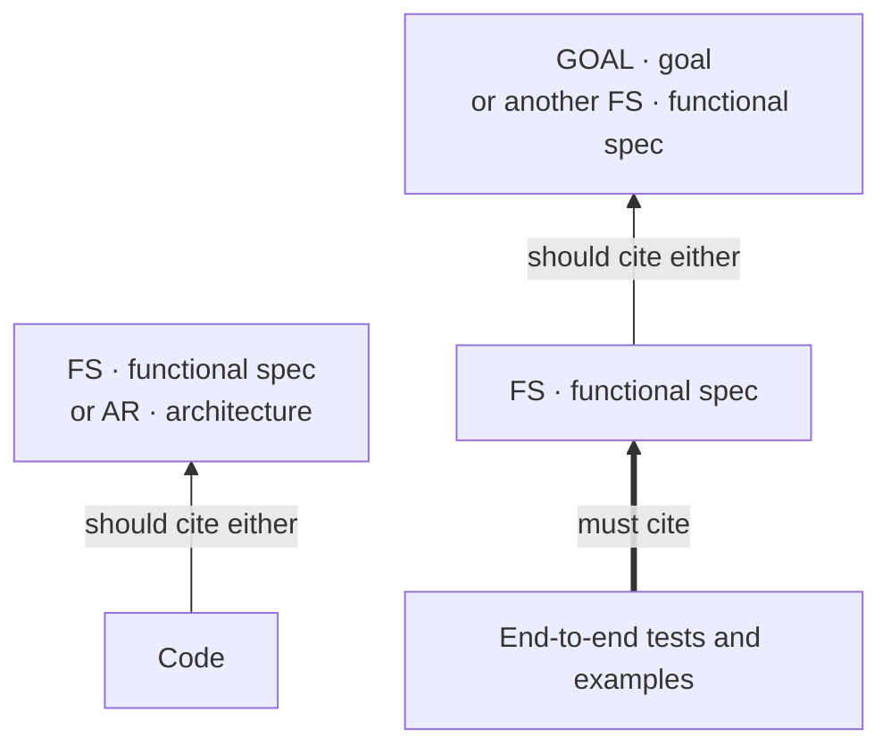

# grund

[](https://github.com/agent-grounds/grund/actions/workflows/ci.yml) [](https://crates.io/crates/grund) [](LICENSE)

> **Keep your agents grounded** — connect code to the spec that explains it.

`grund` gives specs stable IDs, lets code cite them, and checks those citations in CI.
Agents retrieve the section they need before editing ([§GRUND-grund](docs/grund.md#grund-grund-agents-stay-grounded-in-the-spec)).

- **Structure:** define your kinds of fact, their homes and their IDs in `grund.toml`; retrieve one section at a time ([§GRUND-schema](docs/grund.md#grund-schema-the-shape-of-a-projects-knowledge-is-hard-to-define-and-to-keep)).
- **Checks:** catch broken citations and violations of your declared rules in pre-commit and CI ([§GRUND-links](docs/grund.md#grund-links-the-cross-linking-rules-are-hard-to-define-and-to-hold)).

[Quick start](#quick-start) · [Try the example](examples/quickstart/) · [Guides](docs/user-facing/README.md)

## How it works

<!-- grund:fmt off -->
<table>
<tr>
<td valign="top" width="50%">
<b>1 · Declare</b><br>
Give a requirement an ID<br>
<code>requirements.md</code>
<pre>
&#35; FS-name: Display names&#10;
&#35;&#35; 1. Trim whitespace&#10;
Trim surrounding whitespace.
</pre>
</td>
<td valign="top" width="50%">
<b>2 · Cite</b><br>
Point code at that requirement<br>
<code>src/name.py</code>
<pre>
def clean_name(name):
    """&#167;FS-name.1"""
    return name.strip()
</pre>
</td>
</tr>
<tr>
<td colspan="2">
<b>3 · Check</b><br>
Rename section <b>1 → 2</b> without updating the citation.<br>
CI catches the broken reference:
<pre>
$ grund check
src/name.py:2: error: missing section FS-name.1
</pre>
</td>
</tr>
</table>
<!-- grund:fmt on -->

From the [runnable example](examples/quickstart/):
[requirement](examples/quickstart/repo/requirements.md),
[code](examples/quickstart/repo/src/name.py), and captured failure output.
Its citations are checked inside that example's own repository.

**A valid citation does not prove the code implements the requirement.** Returning
`name` unchanged while keeping the citation would still pass this check; tests and review
verify behavior. Grund checks citation targets and declared structural rules.
[Lychee](https://lychee.cli.rs/) checks ordinary links; both belong in CI
([§GRUND-links.2](docs/grund.md#2-holding-every-edit-to-them)). The
[requirements-traceability comparison](docs/related-work/REL-traceability-tools.md#workmatrix-reader-tasks)
sets `grund` beside the tools it descends from.

## What an agent reads

Before editing, an agent retrieves the cited requirement. Inside the example:

```console
$ grund FS-name.1
## 1. Trim whitespace

Trim surrounding whitespace.
```

For a larger specification, it can choose how much to read. These rounded word
counts are measured on Grund's own `FS-check` specification:

| An agent runs | and reads |
|---|---|
| `grund FS-check` | the lead — **~30 words** |
| `grund FS-check.3.2` | one section — **~140 words** |
| `grund FS-check --toc` | the lead and a map of ~250 sections — **~1,800 words** |
| `grund FS-check --full` | the whole specification — **~32,000 words** |

One rule in an agent's instructions keeps that loop: *when you see `§<ID>`, run
`grund <ID>` and treat what it prints as the authoritative definition.* Every agent
fetches the same bytes for the same ID. [Querying grund](docs/user-facing/querying.md)
has the recipes past this ladder; [coordinate sizes](docs/user-facing/coordinate-sizes.md)
shows how to find and split a lead that grew too heavy.

## The map

Kinds and citation rules are configurable. Here is a simplified part of Grund's
own schema, showing required targets and recommended alternatives:



A thin arrow is a recommendation (`grund check --suggestions`); a thick one is a
requirement, whose absence is an error. Same-kind citations are allowed; this is
not a universal hierarchy. This repository also forbids functional specs,
requirements and examples from citing architecture. The
complete statement is the [citation directions in `AGENTS.md`](AGENTS.md#citation-directions);
kinds, homes and the ID grammar are in the [structure guide](docs/user-facing/structure.md),
and the `[citations]` grammar in [citation directions](docs/user-facing/citation-directions.md).

## Quick start

```bash
cargo install grund
```

First, [try the display-name example](examples/quickstart/): retrieve its
requirement, get a passing check, then break and repair the citation in a temporary copy.

For your own project, run the following **inside its repository** if you are
starting with new specs:

```bash
grund init --docs     # writes config, agent instructions, and doc scaffolds
grund check
```

**Already have specs?** [Map their existing locations](docs/user-facing/setup.md)
before running `grund init`; use `--docs` only when you want scaffolds.
`init` writes your agent's instructions from `grund.toml` — ours is
[`AGENTS.md`](AGENTS.md). Add `grund check` to [pre-commit and CI](docs/user-facing/checking.md#in-pre-commit-and-ci).
[Installation](docs/user-facing/installation.md) covers prebuilt binaries, supported
platforms, the Python and Node APIs, and local candidate builds.

## Go deeper

| Guide | For |
|---|---|
| [Checking a repository](docs/user-facing/checking.md) | what `grund check` enforces, its report, `--watch`, `--only`, pre-commit |
| [Structure and IDs](docs/user-facing/structure.md) | kinds, ID schemes, citation syntax, inline declarations |
| [Querying grund](docs/user-facing/querying.md) | selectors, batch reads, `refs`, `cover` |
| [Reviewing code](docs/user-facing/reviewing.md) | a citation's blast radius, diff recipes |
| [Chapter rules](docs/user-facing/rules.md) | checked rules in controlled English — [runnable example](examples/rules/) |
| [Values](docs/user-facing/values.md) | one value, declared once, checked wherever it is quoted |
| [External facts](docs/user-facing/external-facts.md) | cite tickets as committed offline snapshots |
| [Workspaces](docs/user-facing/repository-options.md#workspaces-and-sub-projects) | citations across sub-projects |
| [Clickable citations](docs/user-facing/clickable-citations.md) | `grund integrations` for your terminal and editor |
| [Editor support](docs/user-facing/lsp.md) | `grund-lsp`: completion, hover, diagnostics, `$$` → `§` |
| [All guides](docs/user-facing/README.md) | each beside its runnable example |

`grund --help` is one screen; `grund <command> --help` is one page with flags, examples,
and exit codes.

The [benchmark report](docs/benchmarks.md) preserves a 2026-05-20 local timing run and a historical instruction-count snapshot, with methodology and build assumptions. [Current CI](docs/architecture/AR-ci.md#51-pull-requests-and-pushes) compares instruction counts on generated fixtures against the PR base branch. Counts proxy workload cost, not elapsed time; [regression limits are not enforced](docs/architecture/AR-ci.md#52-regression-limits).

`grund` follows its own scheme: [why](docs/grund.md), [goals](docs/goals.md),
[roadmap](docs/roadmap.md), [changelog](docs/changelog.md). This README is under spec
too — [§REQ-readme](docs/requirements/REQ-readme.md#req-readme-the-readme-is-the-grounded-shop-window): excerpts come from this repository or its runnable examples,
whose citations are checked in their own repositories.
